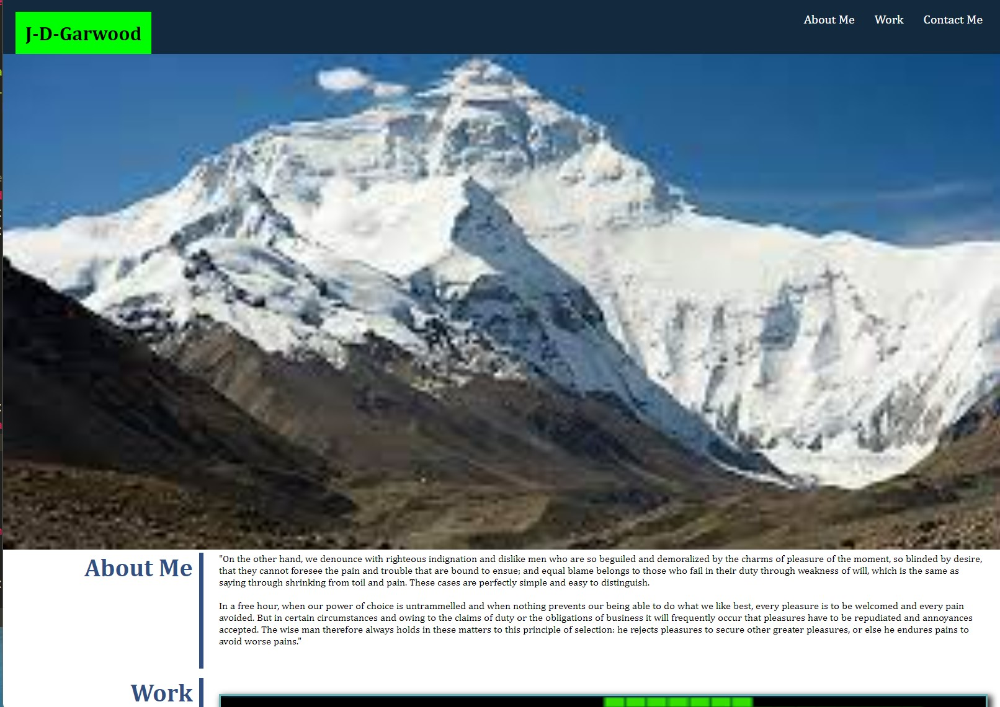

# 02-Challenge

## Description
- What was your motivation?
My motivation of this project was to build a template for a coding portfolio I can build as I progress through my programming journey.

- Why did you build this project? 
^

- What problem does it solve?
^

- What did you learn?
I learnt more about using the flex attribute to order my webpage. I also learnt more about using psuedoclasses like ":hover"

## Installation

Navigate to github repo at https://github.com/J-D-garwood/J-D-Garwoods-Coding-Project-Portfolio. Download all files (index.html, assets folder w/ css and images)

## Credits

No collaborators on this project

## License

N/a

## Image of deployed application

